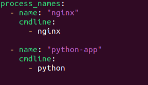
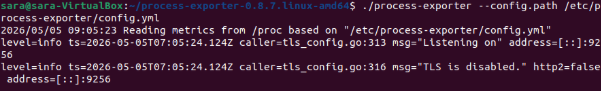
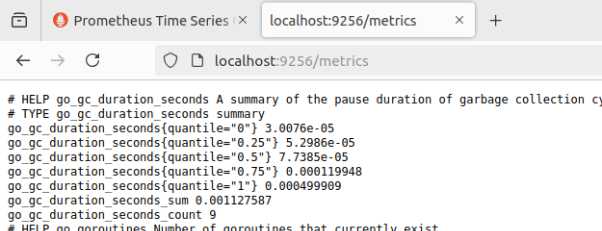
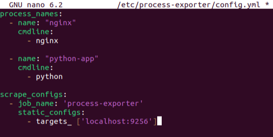
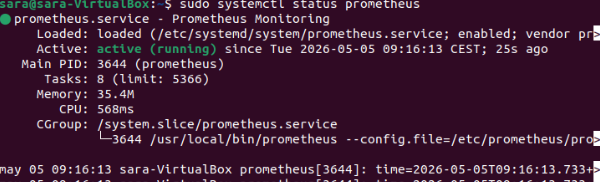
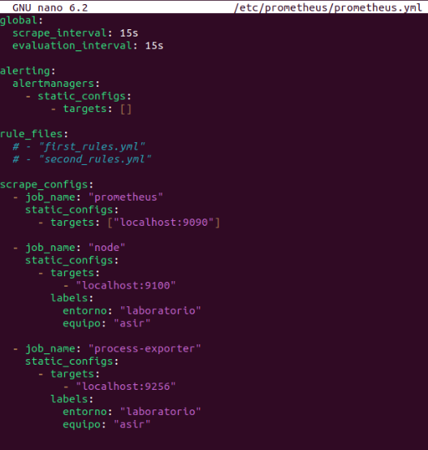
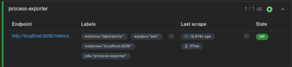
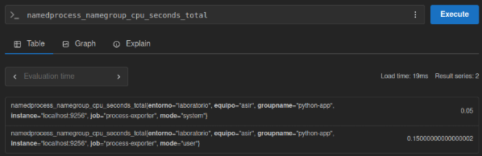

# **Process-Exporter**


### Identificación
*Sara Cordón Goy*


## ¿Qué hace este exporter?

Process Exporter se encarga de gestionar los procesos específicos de la aplicación. 
Su objetivo es controlar la calidad general de la app.

<br>

## ¿Cómo se instala?

### 1. Descargamos Process-Exporter --> Vamos al repositorio oficial de GitHub y descargamos el binario:
```bash
wget https://github.com/ncabatoff/process-exporter/releases/download/v0.8.7/process-exporter-0.8.7.linux-amd64.tar.gz
```

<br>

### 2. Descomprimimos y comprobamos los archivos que contiene:
```bash
tar -xvf process-exporter-*.linux-amd64.tar.gz
ls -d process-exporter-*
cd process-exporter-0.8.7.linux-amd64
```

<br>

### 3. Creamos la carpeta de configuración y posteriormente el archivo:
```bash
sudo mkdir -p /etc/process-exporter
sudo nano /etc/process-exporter/config.yml
```


Process-Exporter necesita saber qué procesos monitorizar, por lo que creamos el archivo "config.yml" con los siguientes parámet6.ros.

<br>

### 4. A continuación, ejecutamos Process-Exporter:
```bash
./process-exporter --config.path /etc/process-exporter/config.yml
```
En este punto, ya está funcionando correctamente. Nuestra terminal tiene el siguiente aspecto:



Esto significa que el Exporter está encendido, escuchando en el puerto 9256 y leyendo los procesos de /proc. Por defecto, expone métricas en: [Prometheus /metrics](http://localhost:9256/metrics)



<br>

### 5. Ahora toca configurar Prometheus editando el archivo prometheus.yml y añadimos un nuevo job:



Al añadir este job estamos indicando que queremos que estas métricas aparezcan en Prometheus.

<br>

### 6. Reiniciamos Prometheus, comprobando el estado y verificando métricas.
```bash
sudo systemctl restart prometheus
sudo systemctl status prometheus
```


<br>

### 7. Editamos el archivo yml de Prometheus mediante el siguiente comando, y añadimos las líneas correspondientes al job anteriormente mencionado:
```bash
sudo nano /etc/prometheus/prometheus.yml
```



Ya funciona correctamente, muestra métricas y aparece en Prometheus.



<br>

### 8. Abrimos Prometheus en http://localhost:9090 y probamos una consulta como:
```bash
namedprocess_namegroup_cpu_seconds_total
```



