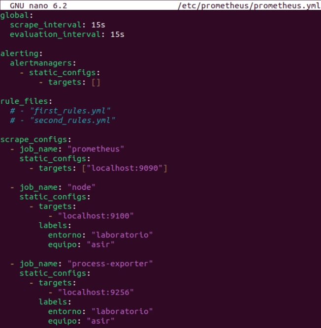
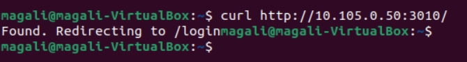

# Prometheus - Instalación Final

**Magali Pérez**
---

# ¿Qué es Prometheus?

Prometheus es una herramienta de monitorización y recopilación de métricas de código abierto.
Permite supervisar servidores, servicios, aplicaciones y contenedores en tiempo real mediante 
métricas obtenidas desde distintos exporters.

Prometheus almacena toda la información en series temporales y posteriormente puede visualizarse mediante herramientas como Grafana.

---

# ¿Para qué sirve?

Prometheus se utiliza para:

- Monitorizar el estado de servidores Linux y Windows.
- Supervisar el consumo de CPU, RAM, disco y red.
- Detectar fallos o sobrecarga del sistema.
- Obtener métricas de servicios y aplicaciones.
- Generar alertas automáticas.
- Visualizar estadísticas en tiempo real.

---

# Arquitectura del proyecto

En nuestro proyecto utilizaremos distintos exporters para monitorizar el estado general de la aplicación y del servidor.

Nuestro objetivo principal será supervisar:

- Latencia
- Errores
- Tráfico
- Saturación del sistema

Para ello implementaremos los siguientes exporters:

| Exporter | Función principal |
|---|---|
| Blackbox Exporter | Monitorización externa mediante peticiones HTTP, HTTPS y ping |
| Node Exporter | Obtención de métricas del hardware y sistema operativo |
| MySQLd Exporter | Supervisión de la base de datos MySQL |
| Process Exporter | Monitorización de procesos específicos de la aplicación |
| SSL Exporter | Verificación del estado y seguridad de certificados SSL |

---

# Configuración del fichero prometheus.yml

El archivo `prometheus.yml` es el encargado de indicar a Prometheus qué exporters debe monitorizar y en qué puerto se encuentran disponibles.

Cada exporter estará asociado mediante un `job_name`, utilizando la dirección IP del servidor y el puerto correspondiente.

---

# Estructura general

| Exporter | Puerto |
|---|---|
| Prometheus | 9090 |
| Node Exporter | 9100 |
| Blackbox Exporter | 9115 |
| Process Exporter | 9256 |
| MySQL Exporter | 9104 |
| SSL Exporter | 9219 |

---

# Configuración del fichero prometheus.yml

# Acceso desde nuestra máquina al servidor

Desde nuestra máquina cliente accedemos mediante navegador web utilizando la IP del servidor y el puerto correspondiente.

## Acceso a Prometheus

A través de la terminal de Prometheus nos conectamos poniendo la ip del server y el puerto correspondiente

Luego en el navegador ponemos lo mismo, la ip del servidor, el puerto seguido de /metrics

